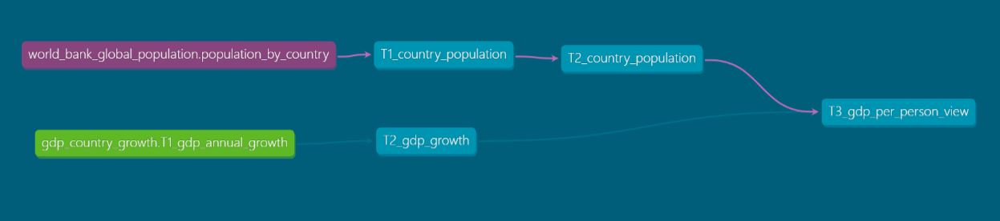
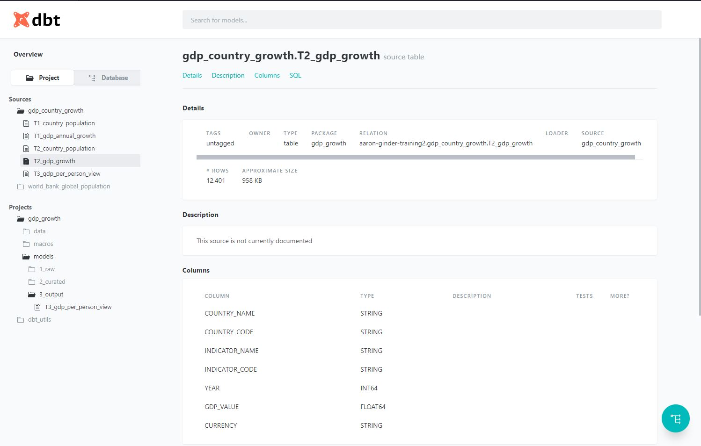

# **BigQuery Transformation dbt Data Pipeline**

## **Purpose of Repository**
To use dbt as an orchestration tool to process a static file and join two data sources together. This repository can be used as a template example of creating a dbt pipeline with testing.

See the two simple sets below to using the dbt pipeline to generate tables in BigQuery (GCP).

## **Navigation**

# | Item| `Code`
--- | --- | ---
 1| [dbt SQL Scripts](https://github.com/aaronginder/gdp-growth-project/tree/master/scripts)| `N/A`
 2| [Executing the pipeline](https://github.com/aaronginder/gdp-growth-project/tree/master/scripts)| `dbt run --project-dir . --profiles-dir .`
 3| [dbt auto documentation](https://github.com/aaronginder/gdp-growth-project)| `dbt docs generate --project-dir . --profiles-dir .`
 4| [dbt container](https://github.com/aaronginder/gdp-growth-project/tree/master/containerisation)| `docker-compose up` / `docker compose-down`
 5| [Custom macro test](https://github.com/aaronginder/gdp-growth-project/tree/master/macros)| `dbt test run --project-dir . --profiles-dir .`

## **Pre-requisites**
To follow the instructions, you must have the following software installed:
* Google Cloud SDK
* Git

If you do not have the above installed, Cloud Shell can be used in your Google Cloud Platform project.

## **What is dbt?**
The data build tool (dbt) is a CLI that empowers analytics developers, data engineers and scientists to run the transform part of ETL. The rise of cloud providers such as Google Cloud, AWS, Azure and Snowflake that provide products for extraction has led to tools such as dbt or dataform being created.

dbt is responsible for the orchestration of sql queries by abstracting the complexities around DAG creation and allows users with little to minimum coding experience the ability to create complex data pipelines using yaml configuration and sql only.

[Visit the official dbt docs for more information...](https://docs.getdbt.com/docs/introduction)

## **Example BigQuery Pipeline**
### Introduction
This repository is a good starting point for those just getting to grips with dbt. This repository shows configurations for the gdp_growth_project pipeline. The purpose of the pipeline is to bring together two tables in a format that calculates the GDP per person (yes, not the most exciting).

This is the data flow diagram the pipeline builds:

### **Instructions**
Below guides you through using this repository to run a dbt pipeline in your Google Cloud Platform environment. All the instructions should be executed in your terminal.

#### **1. Clone this repository & set up your environment**
* Clone this repository by running `git clone https://github.com/aaronginder/gdp-growth-project` in your terminal
* Change into the repository directory `cd gdp-growth-project`
* Set up your environment by running `. scripts/set_up_env.sh` - creates various resources in GCP and sets environment variables for terminal session

#### **2. Run the dbt pipeline**
* Retrieve dbt_utils package by executing `dbt deps` in your terminal
* Run the dbt pipeline by executing `. ./scripts/run_dbt.sh` - this will run the dbt pipeline & tests

### **Generating dbt documentation**
dbt generates documentation based on your SQL files and YAML configuration files. For example, generating detailed schemas based on the schema.yml file & generating a directed acyclic graph to show the data flow based on your SQL.

1. Run `dbt docs generate --project-dir . --profiles-dir .` to create your documentation
2. Navigate to the targets/index.html file. Either install HTML Preview extension (if using VS Code) or copy & paste the path into a browser
#### **Example dbt docs**

## **dbt Resources**
- Learn more about dbt [in the docs](https://docs.getdbt.com/docs/introduction)
- Check out [Discourse](https://discourse.getdbt.com/) for commonly asked questions and answers
- Join the [chat](http://slack.getdbt.com/) on Slack for live discussions and support
- Check out [the blog](https://blog.getdbt.com/) for the latest news on dbt's development and best practices
